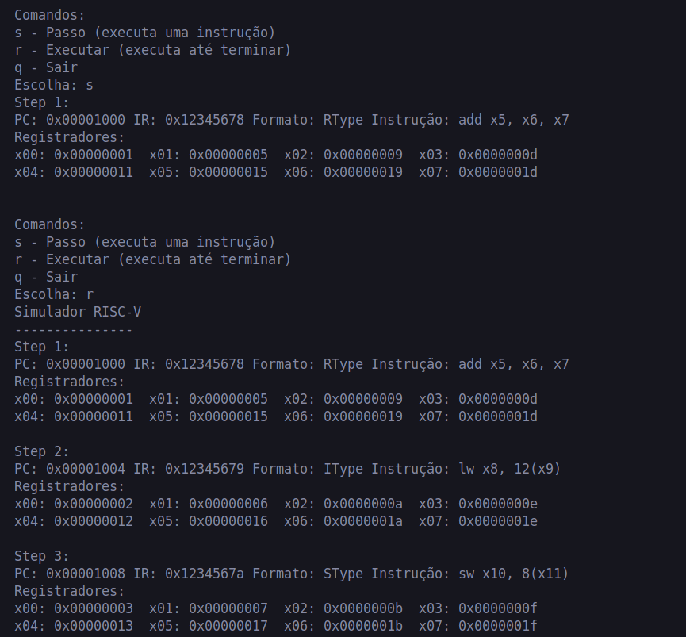

# Relatório de Implementação do Simulador RISC-V

## Descrição do Problema
Este projeto implementa um simulador do conjunto de instruções RISC-V. O simulador é capaz de executar instruções assembly RISC-V através da emulação do comportamento do processador, incluindo os ciclos de busca, decodificação e execução de instruções. O simulador suporta múltiplos formatos de instruções e fornece capacidades de acesso à memória.

## Instruções Implementadas
O simulador suporta várias instruções RISC-V em diferentes formatos:

### Instruções Tipo R
- Aritméticas: `add`, `sub`
- Lógicas: `and`, `or`, `xor`
- Deslocamento: `sll`, `srl`, `sra`
- Comparação: `slt`, `sltu`

### Instruções Tipo I
- Aritméticas: `addi`
- Lógicas: `andi`, `ori`, `xori`
- Deslocamento: `slli`, `srli`, `srai`
- Comparação: `slti`, `sltiu`
- Carregamento: `lb`, `lw`, `lbu`
- Salto: `jalr`

### Instruções Tipo S
- Armazenamento: `sb`, `sw`

### Instruções Tipo B
- Desvio: `beq`, `bne`, `blt`, `bge`, `bltu`, `bgeu`

### Instruções Tipo U
- Imediato Superior: `lui`, `auipc`

### Instruções Tipo J
- Salto: `jal`

### Instruções de Sistema
- `ecall`

## Testes e Resultados
O simulador foi testado usando o arquivo `test.asm` fornecido, que inclui vários casos de teste para verificar:
- Operações aritméticas entre registradores
- Operações aritméticas com imediatos
- Operações de carregamento e armazenamento na memória
- Instruções de desvio e salto
- Operações com imediatos superiores

### Exemplo de Execução


O simulador executa com sucesso essas instruções e mantém o estado correto do processador, incluindo:
- Atualizações do Contador de Programa (PC)
- Modificações no banco de registradores
- Operações de acesso à memória
- Avaliação de condições de desvio

## Informações do Código Fonte

### Ambiente de Desenvolvimento
- **Sistema Operacional**: Linux
- **Compilador**: g++
- **IDE**: Visual Studio Code

### Estrutura do Projeto
- `main.cpp`: Ponto de entrada do simulador, implementa a interface do usuário
- `instruction.cpp/h`: Manipulação e execução de instruções
- `registers.cpp`: Gerenciamento do banco de registradores e estado do processador
- `globals.h`: Definições globais e estruturas de dados
- `acesso_memoria.cpp/h`: Implementação do acesso à memória
- `decode.cpp`: Lógica de decodificação de instruções
- `simulator.cpp`: Funcionalidade principal do simulador

### Componentes Principais
1. **Sistema de Memória**
   - Espaço de memória de 16KB
   - Memória endereçável por byte
   - Suporte para acesso a bytes e palavras

2. **Banco de Registradores**
   - 32 registradores de uso geral
   - Registradores especiais (PC, SP, GP)
   - Tratamento do registrador zero (x0)

3. **Processamento de Instruções**
   - Busca: Lê instrução da memória
   - Decodificação: Extrai campos da instrução
   - Execução: Realiza a operação da instrução

### Sistema de Compilação
O projeto usa Make para compilação. Para compilar e executar:

```bash
make
./main
```

O simulador fornece uma interface interativa com os comandos:
- `s`: Step (executa uma instrução)
- `r`: Run (executa até completar)
- `q`: Sair
