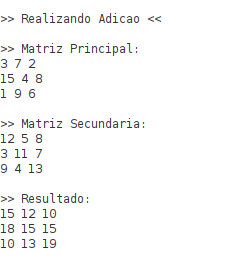
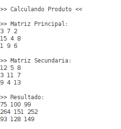
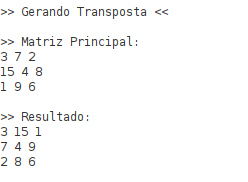

# Trabalho 3 - Operações com Matrizes em Assembly RISC-V

## Descrição
Este programa implementa operações básicas com matrizes 3x3 em Assembly RISC-V. As operações incluem soma, multiplicação e transposição de matrizes.

## Estrutura do Programa

### 1. Dados
- `mat_a`: Matriz principal 3x3 para testes
- `mat_b`: Matriz secundária 3x3 para testes
- `mat_r`: Matriz resultado 3x3 (inicializada com zeros)

### 2. Funções Principais

#### 2.1 Adição de Matrizes
```pseudo
adicionar(m1, m2, mr, tam):
    Para i de 0 até tam-1:
        Para j de 0 até tam-1:
            mr[i][j] = m1[i][j] + m2[i][j]
```

#### 2.2 Multiplicação de Matrizes
```pseudo
multiplicar(m1, m2, mr, tam):
    Para i de 0 até tam-1:
        Para j de 0 até tam-1:
            soma = 0
            Para k de 0 até tam-1:
                soma += m1[i][k] * m2[k][j]
            mr[i][j] = soma
```

#### 2.3 Transposição de Matriz
```pseudo
transpor(m1, mr, tam):
    Para i de 0 até tam-1:
        Para j de 0 até tam-1:
            mr[j][i] = m1[i][j]
```

#### 2.4 Visualização de Matriz
```pseudo
mostrar(m1, tam):
    Para i de 0 até tam-1:
        Para j de 0 até tam-1:
            Imprimir m1[i][j]
        Imprimir quebra de linha
```

### 3. Matrizes de Teste
```
mat_a = | 3  7  2 |    mat_b = | 12  5  8 |
        | 15 4  8 |            |  3 11  7 |
        | 1  9  6 |            |  9  4 13 |
```

## Como Usar
1. Execute o programa no simulador RARS
2. Observe as matrizes de teste exibidas
3. Escolha uma operação do menu:
   - 1: Adição
   - 2: Multiplicação
   - 3: Transposição
   - 4: Visualização
   - 5: Sair
4. Veja o resultado da operação
5. Repita ou escolha 5 para sair

## Exemplos de Execução

### Adição de Matrizes


### Multiplicação de Matrizes


### Transposição de Matriz


## Observações
- Todas as matrizes são 3x3
- Os elementos são números inteiros
- As matrizes são armazenadas na memória em formato linear
- O programa usa registradores s0-s3 para loops e t0-t5 para cálculos temporários