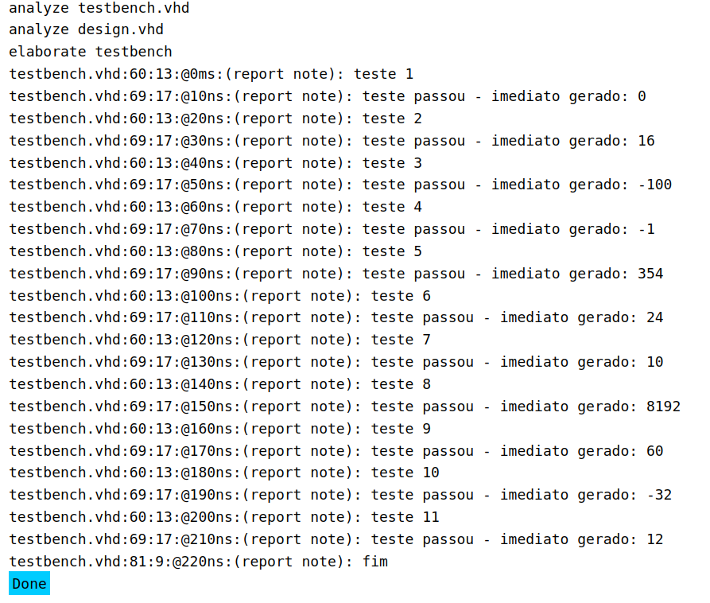

# Relatório - Imediatos RISC-V - Trabalho 4
# Aluno: Caetano Korilo - 212006737

## Qual a razão do embaralhamento dos bits do imediato no RiscV?

O embaralhamento dos bits acontece porque o RISC-V precisa encaixar os imediatos em diferentes formatos de instrução, mantendo sempre 32 bits no total. Como cada tipo de instrução (tipo-R, tipo-I, etc) tem campos diferentes, os bits do imediato acabam tendo que ser distribuídos nos espaços que sobram.

## Por que alguns imediatos não incluem o bit 0?

Nas instruções de branch e jump, o bit 0 é sempre forçado pra 0 (tipo colocar um zero no final do número) por dois motivos:

- Garante que os endereços de salto sejam sempre pares (alinhados)

- Como o bit 0 é sempre 0, dá pra representar números 2x maiores com a mesma quantidade de bits

## Os imediatos de operações lógicas estendem o sinal?

Sim, a maioria das operações lógicas estende o sinal do imediato. A única exceção é o srai que tem um tratamento especial pra pegar só 5 primerios bits do shamt.

## Como é implementada a instrução NOT no RiscV?

O RISC-V não tem uma instrução NOT própria do processador, mas isso não é um problema porque dá pra implementar usando o XORI (XOR immediate) com -1, que em binário é todos os bits em 1.

Funciona assim: quando você faz XOR com 1, o bit inverte (0 vira 1 e 1 vira 0). Então, quando você faz XOR com todos os bits 1 (-1), você acaba invertendo todos os bits do número original. É uma solução  que economiza uma instrução no conjunto de instruções do processador.

## Resultado

