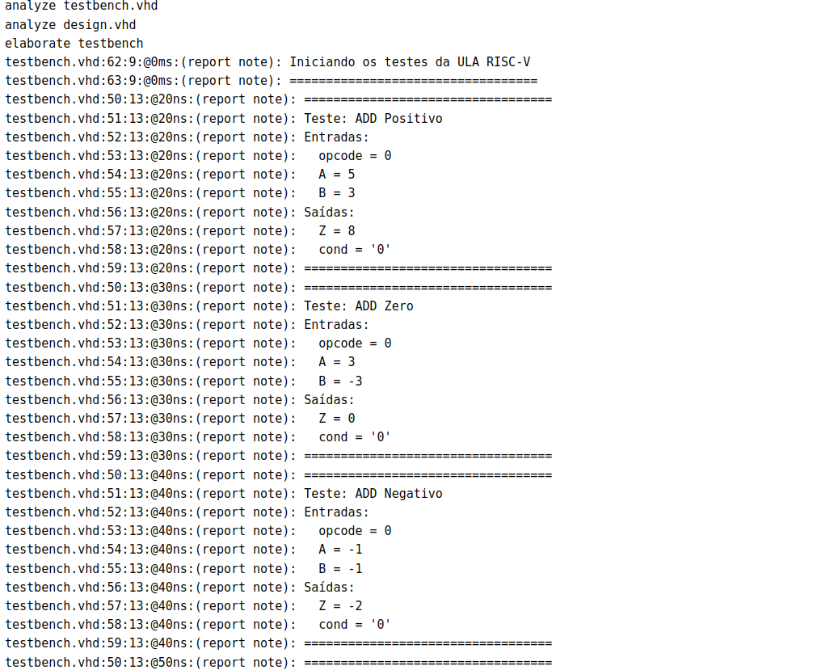
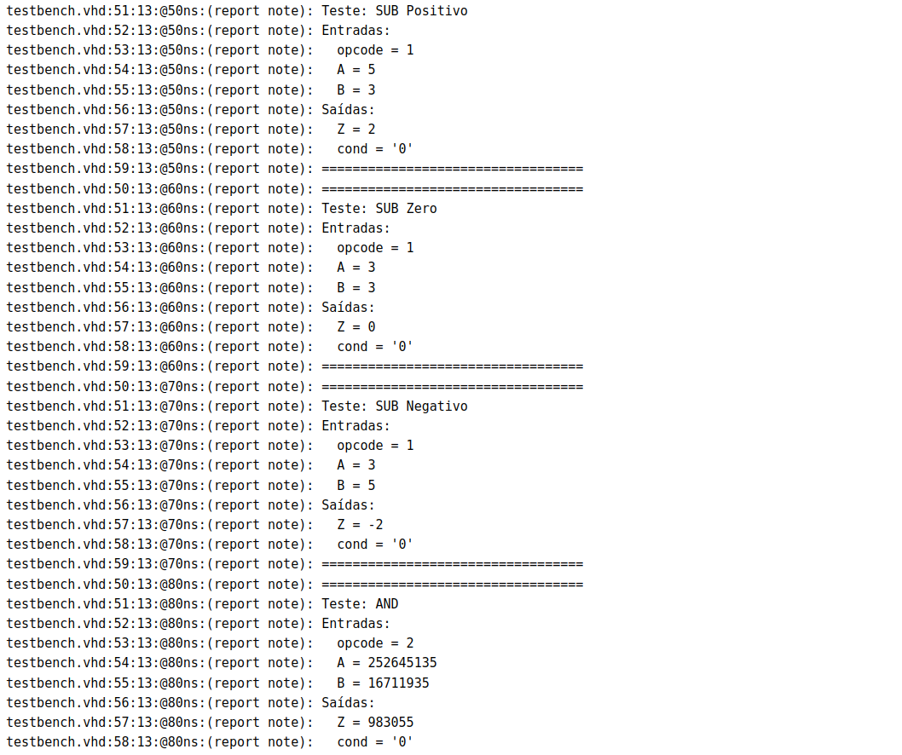
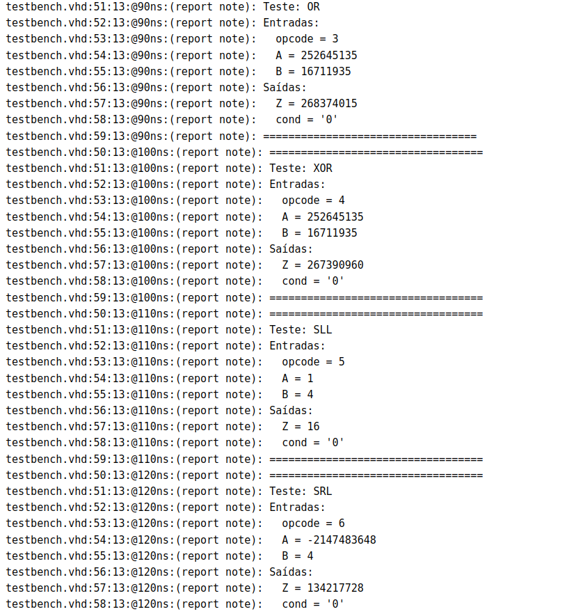
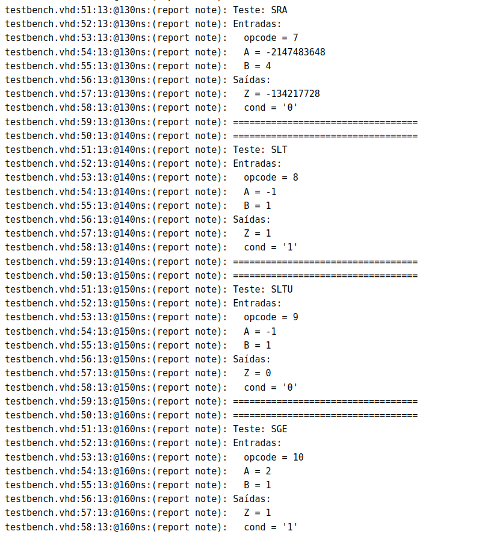
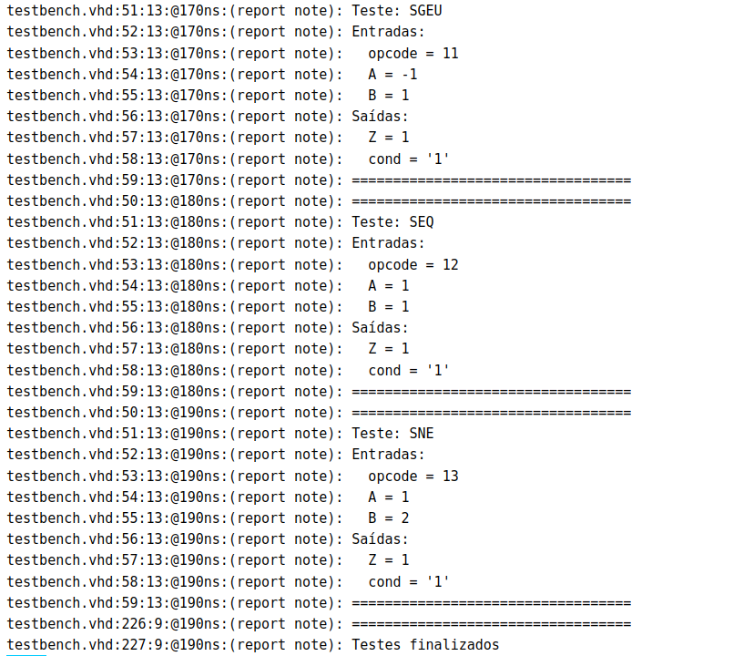
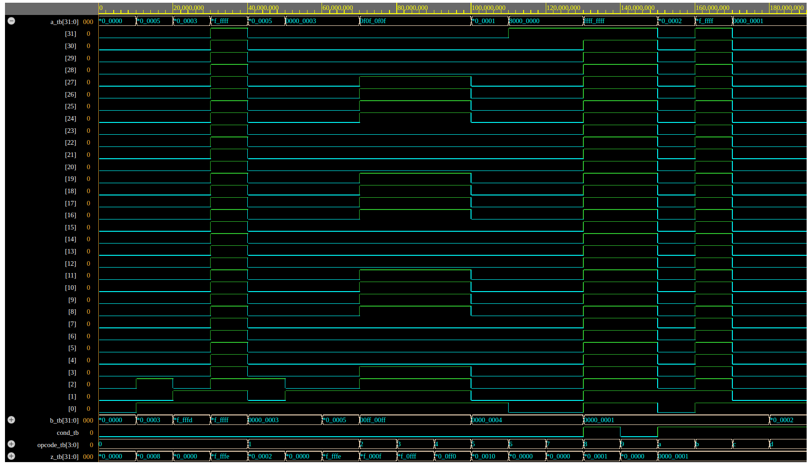
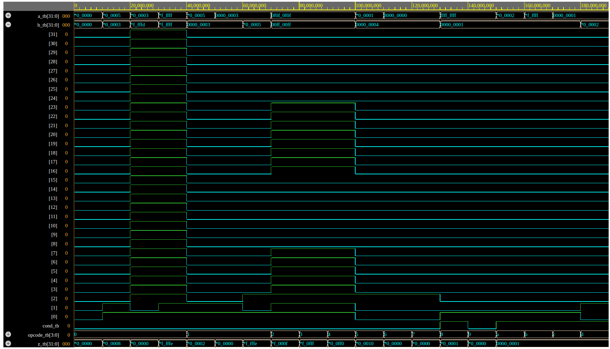
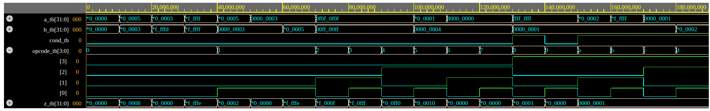
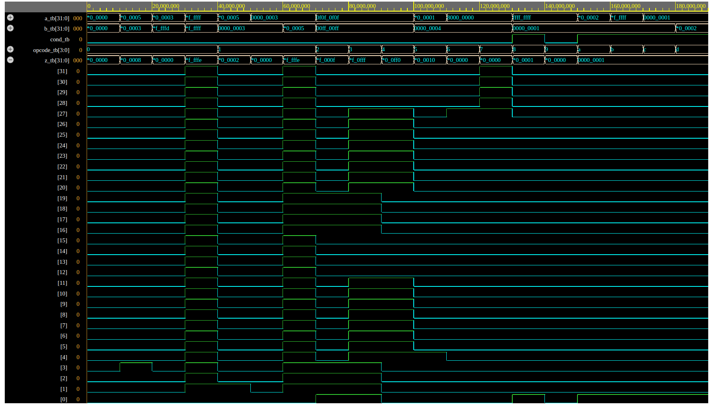
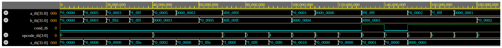

# Relatório - ULA RISC-V

Nesse trabalho foi implementada uma ULA básica pro processador RISC-V. A ULA realiza operações aritméticas (ADD/SUB), lógicas (AND/OR/XOR), shifts e comparações, sendo um componente essencial do processador.

## Visão Geral

Este projeto implementa uma Unidade Lógica Aritmética (ULA) de 32 bits para o processador RISC-V. A ULA é um componente fundamental do processador, responsável por realizar operações aritméticas, lógicas e de comparação.

## Comparações com e sem sinal

A principal diferença entre SLT (Set Less Than) e SLTU (Set Less Than Unsigned) está na interpretação dos números:

No SLT (com sinal):

- O bit mais significativo indica se o número é negativo
- Por exemplo: 0xF0000000 é interpretado como um número negativo
- Então 0xF0000000 < 0x00000001 é verdadeiro

No SLTU (sem sinal):

- Todos os bits são considerados parte do valor
- 0xF0000000 é interpretado como um número grande positivo
- Então 0xF0000000 > 0x00000001 é verdadeiro

## Implementação

### Estrutura da ULA

A ULA foi implementada com as seguintes características principais:

1. **Interface**:
   - Entradas:
     - `opcode`: 4 bits para seleção da operação
     - `A`, `B`: operandos de 32 bits
   - Saídas:
     - `Z`: resultado de 32 bits
     - `cond`: flag de condição para operações de comparação

2. **Operações Suportadas**:
   - Aritméticas: ADD, SUB
   - Lógicas: AND, OR, XOR
   - Deslocamentos: SLL, SRL, SRA
   - Comparações: SLT, SLTU, SGE, SGEU, SEQ, SNE

### Detalhes de Implementação

1. **Conversão de Tipos**:
   - Utilização de sinais auxiliares para manipulação signed/unsigned
   - Facilita operações com e sem sinal

2. **Tratamento de Operações**:
   - Uso de process com case para seleção de operações
   - Variáveis temporárias para armazenar resultados intermediários

3. **Integração com Trabalho Anterior**:
   - Mantida compatibilidade com o gerador de imediatos (trab4)
   - Possibilidade de integração futura em um processador completo

## Resultados da Simulação

### Capturas de Tela dos Testes

1. Operações Aritméticas (ADD):

2. Operações Lógicas (SUB, AND):

3. Operações de Deslocamento (OR, XOR, SLL, SRL):

4. Operações de Comparação (SRA, SLT, SLTU, SGE):

5. Operações de Comparação (SGEU, SEQ, SNE):

6. Telas de simulação com formas de onda (a_tb)

7. Telas de simulação com formas de onda (b_tb)

8. Telas de simulação com formas de onda (opcode_tb)

9. Telas de simulação com formas de onda (z_tb)

10. Todas as telas de simulação

## Detecção de Overflow

Para detectar overflow nas operações ADD e SUB, é necessário verificar os sinais dos operandos e do resultado:

Na operação ADD:

- Overflow ocorre quando somamos dois números positivos e o resultado é negativo
- Ou quando somamos dois números negativos e o resultado é positivo

Na operação SUB:

- Overflow ocorre quando subtraímos um número negativo de um positivo e o resultado é negativo
- Ou quando subtraímos um número positivo de um negativo e o resultado é positivo

## Conclusão

A ULA implementada atende todos os requisitos do RISC-V RV32I, oferecendo uma base sólida para a construção de um processador completo. A estrutura modular e bem documentada permite fácil manutenção e expansão futura.
